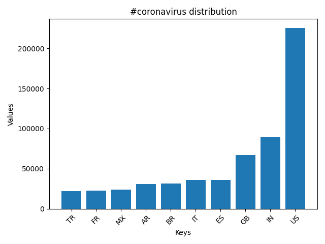
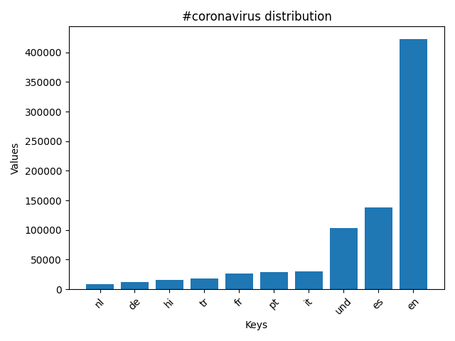
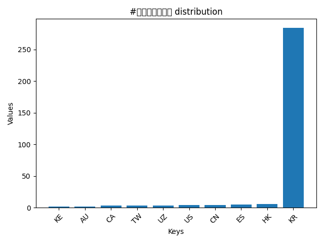
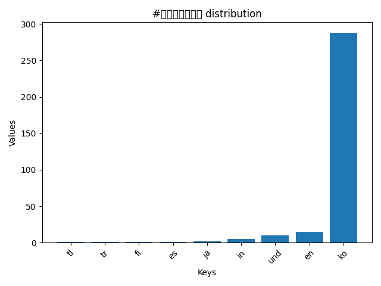
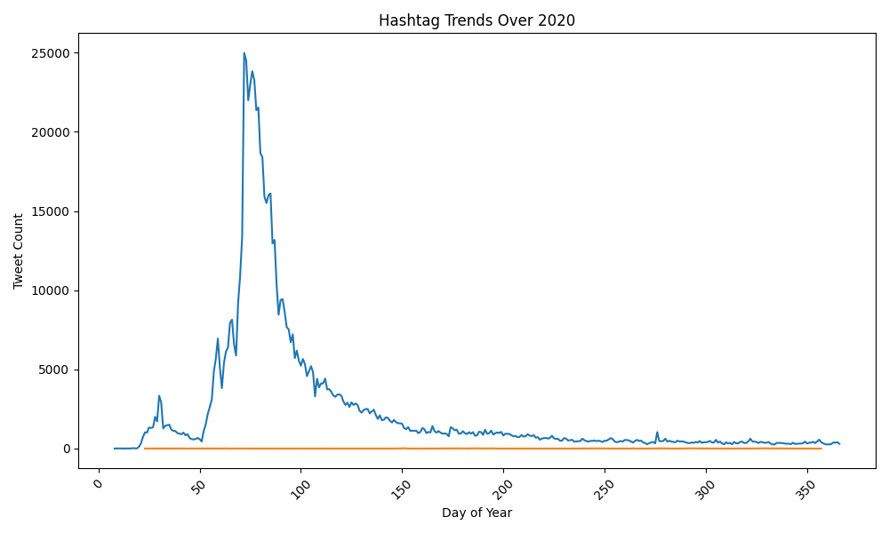

# Coronavirus Twitter Analysis (2020)

This project analyzes geotagged tweets sent in 2020 to monitor the spread and discussion of coronavirus-related topics on social media. Using Python and a MapReduce-style workflow, I processed over a billion tweets to visualize hashtag usage across countries and languages, and to observe trends over the year.

## Project Overview

I processed the 2020 geotagged tweets dataset using a MapReduce approach:

1. **Map Step (`map.py`)**: Counts occurrences of specific hashtags by language and country for each daily dataset.  
2. **Reduce Step (`reduce.py`)**: Aggregates daily counts into comprehensive datasets for languages and countries.  
3. **Visualization (`visualize.py`)**: Generates bar graphs showing the top 10 countries or languages for a selected hashtag.  
4. **Alternative Reduce (`alternative_reduce.py`)**: Generates line plots showing hashtag usage trends over the year, with one line per hashtag. The x-axis represents the day of the year (integer), and the y-axis represents total tweet counts.

## Key Outputs

Number of times `#coronavirus` was tweeted by country over 2020:  

Number of times `#coronavirus` was tweeted by language over 2020:  

Number of times `#코로나바이러스` was tweeted by country over 2020:  

Number of times `#코로나바이러스` was tweeted by language over 2020:  

### Line Plots (Alternative Reduce)

Daily hashtag trends for multiple hashtags, plotted over the year:  

Trends for `#coronavirus` and `#코로나바이러스`:  

> These line plots were generated using `alternative_reduce.py` with all country or language `.json` outputs as input. Each line corresponds to a hashtag, with the x-axis as day-of-year integers and y-axis as the total number of tweets.

## Technologies and Techniques

- **Python** for data processing and visualization.  
- **MapReduce paradigm** for parallel processing of large-scale datasets.  
- **Matplotlib** for generating plots.  
- **JSON** for structured data representation.  

## Demonstrated Skills

- Handling and analyzing extremely large datasets (~1.1 billion tweets).  
- Working with multilingual text and geolocation metadata.  
- Applying parallel processing concepts using MapReduce.  
- Creating clear, descriptive visualizations suitable for reporting and presentation.

